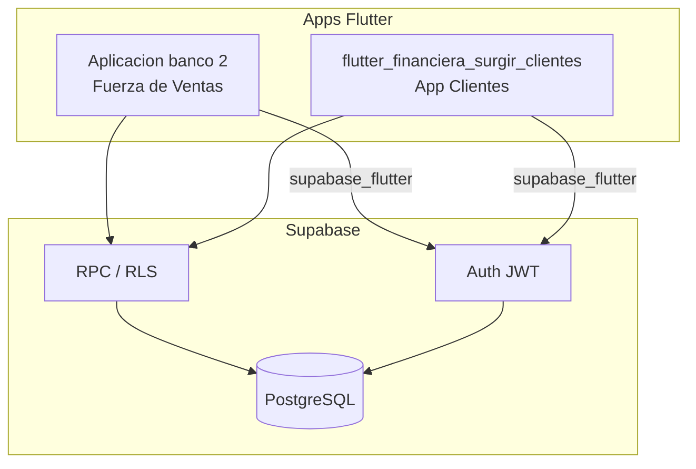
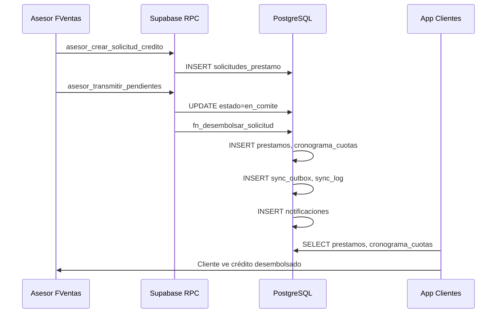
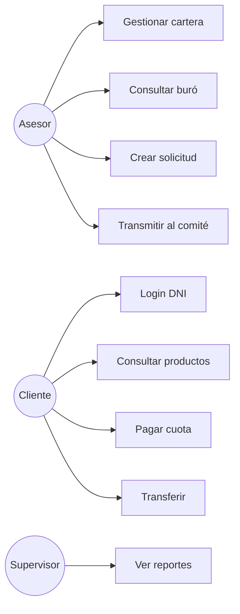
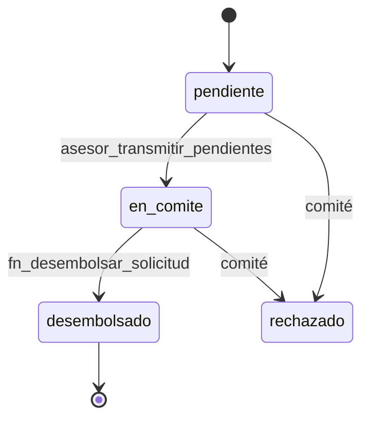
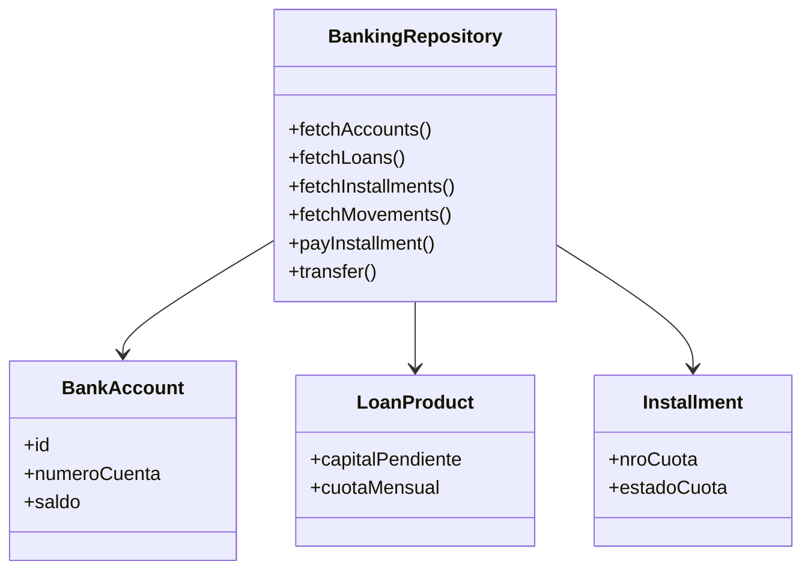

# Diagramas UML — Ecosistema Móvil SURGIR

Arquitectura: **Supabase (PostgreSQL)** como única base de datos compartida.

## Diagrama de componentes

## Diagrama de secuencia — Originación E2E

## Diagrama de casos de uso

## Diagrama de estados — Solicitud de crédito

## Diagrama de clases (dominio banking — app clientes)

